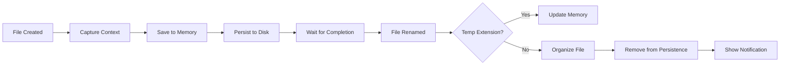

# ? Quick Reference - Telegram Smart Organizer

> ???? ???? ??????? ?????????? ????????

---

## ?? Quick Commands

### Build & Run
```bash
# Full build
dotnet build

# Run UI
dotnet run --project TelegramOrganizer.UI

# Clean build
dotnet clean && dotnet build

# Publish
dotnet publish -c Release
```

---

## ?? Directory Structure

```
TelegramOrganizer/
??? ?? TelegramOrganizer.Core/
?   ??? ?? Contracts/            # Interfaces
?   ?   ??? IContextDetector
?   ?   ??? IFileWatcher
?   ?   ??? IFileOrganizer
?   ?   ??? IPersistenceService
?   ?   ??? ISettingsService
?   ??? ?? Models/               # Data models
?   ?   ??? FileContext
?   ?   ??? AppState
?   ?   ??? AppSettings
?   ??? ?? Services/             # Business logic
?       ??? SmartOrganizerEngine
?
??? ?? TelegramOrganizer.Infra/
?   ??? Services/
?       ??? Win32ContextDetector
?       ??? WindowsWatcherService
?       ??? FileOrganizerService
?       ??? JsonPersistenceService
?       ??? JsonSettingsService
?
??? ?? TelegramOrganizer.UI/
    ??? ViewModels/
    ?   ??? MainViewModel
    ?   ??? SettingsViewModel
    ??? Views/
        ??? MainWindow.xaml
        ??? SettingsWindow.xaml
```

---

## ?? Dependency Injection Map

```csharp
// Registration Order (important!)
services.AddSingleton<ISettingsService, JsonSettingsService>();
services.AddSingleton<IPersistenceService, JsonPersistenceService>();
services.AddSingleton<IContextDetector, Win32ContextDetector>();
services.AddSingleton<IFileWatcher, WindowsWatcherService>();
services.AddSingleton<IFileOrganizer, FileOrganizerService>();
services.AddSingleton<SmartOrganizerEngine>();
```

---

## ?? Key Interfaces

### IContextDetector
```csharp
string GetActiveWindowTitle();   // Get foreground window title
string GetProcessName();          // Get foreground process name
```

### IFileWatcher
```csharp
void Start(string path);              // Start monitoring
void Stop();                          // Stop monitoring
event FileCreated                     // File created event
event FileRenamed                     // File renamed event
```

### IFileOrganizer
```csharp
string OrganizeFile(string filePath, string groupName);
```

### IPersistenceService
```csharp
void SaveState(AppState state);
AppState LoadState();
void AddOrUpdateEntry(string fileName, FileContext context);
void RemoveEntry(string fileName);
int CleanupOldEntries(int retentionDays);
```

### ISettingsService
```csharp
AppSettings LoadSettings();
void SaveSettings(AppSettings settings);
event SettingsChanged
```

---

## ?? Data Models

### FileContext
```csharp
{
    string OriginalTempName,      // "doc.pdf.td"
    string DetectedGroupName,     // "CS50"
    DateTime CapturedAt           // When tracked
}
```

### AppState
```csharp
{
    Dictionary<string, FileContext> PendingDownloads,
    DateTime LastSavedAt,
    string Version,
    int TotalFilesOrganized
}
```

### AppSettings
```csharp
{
    string DestinationBasePath,      // Where to organize
    string DownloadsFolderPath,      // What to monitor
    int RetentionDays,               // Cleanup threshold
    bool StartMinimized,
    bool MinimizeToTray,
    bool ShowNotifications,
    bool UseDarkTheme,
    bool RunOnStartup,
    string Version
}
```

---

## ?? Workflow Sequence



---

## ?? File Locations

### User Data
```
Settings:  %LOCALAPPDATA%\TelegramOrganizer\settings.json
State:     %LOCALAPPDATA%\TelegramOrganizer\state.json
```

### Organized Files (Default)
```
%USERPROFILE%\Documents\Telegram Organized\
```

### Registry (Run on Startup)
```
HKEY_CURRENT_USER\SOFTWARE\Microsoft\Windows\CurrentVersion\Run
Key: TelegramSmartOrganizer
```

---

## ?? MVVM Commands

### MainViewModel
```csharp
[RelayCommand] OpenSettings()      // Open settings window
MinimizeToTray()                   // Hide to system tray
Cleanup()                          // Dispose resources
```

### SettingsViewModel
```csharp
[RelayCommand] BrowseDestination()  // Browse destination folder
[RelayCommand] BrowseDownloads()    // Browse downloads folder
[RelayCommand] Save()               // Save settings
[RelayCommand] Reset()              // Reset to defaults
```

---

## ?? Events Flow

```
FileSystemWatcher.Created
    ?
WindowsWatcherService.FileCreated
    ?
SmartOrganizerEngine.OnFileCreated
    ?
SmartOrganizerEngine.OperationCompleted
    ?
MainViewModel (Update UI)
    ?
NotifyIcon.ShowBalloonTip (if enabled)
```

---

## ?? Common Debug Points

### File Not Organizing
```
1. WindowsWatcherService.OnCreated()     ? Is event firing?
2. SmartOrganizerEngine.OnFileCreated()  ? Is context captured?
3. SmartOrganizerEngine.OnFileRenamed()  ? Is rename detected?
4. FileOrganizerService.OrganizeFile()   ? Any exceptions?
```

### Settings Not Saving
```
1. SettingsViewModel.Save()              ? Button clicked?
2. JsonSettingsService.SaveSettings()    ? File written?
3. Check: %LOCALAPPDATA%\TelegramOrganizer\settings.json
```

---

## ?? Configuration Quick Edit

### Enable Debug Logging
```csharp
// SmartOrganizerEngine.cs
#define DEBUG_LOG

OperationCompleted?.Invoke(this, $"[DEBUG] {message}");
```

### Change Default Retention
```csharp
// AppSettings.cs
public int RetentionDays { get; set; } = 60; // Changed from 30
```

### Add New Temp Extension
```csharp
// SmartOrganizerEngine.cs
private bool IsTemporaryFile(string fileName)
{
    return lower.EndsWith(".td") ||
           lower.EndsWith(".tpart") ||
           lower.EndsWith(".crdownload") ||
           lower.EndsWith(".part") ||
           lower.EndsWith(".tmp");  // Added
}
```

---

## ?? NuGet Packages Used

```xml
<!-- TelegramOrganizer.UI -->
<PackageReference Include="CommunityToolkit.Mvvm" Version="8.4.0" />
<PackageReference Include="Microsoft.Extensions.DependencyInjection" Version="10.0.2" />
```

---

## ?? Keyboard Shortcuts (Future)

```
Ctrl + S     ? Open Settings
Ctrl + H     ? Hide to tray
Ctrl + Q     ? Quit application
F5           ? Refresh status
```

---

## ?? Performance Metrics

| Operation | Expected Time |
|-----------|---------------|
| File Create Detection | < 100ms |
| Context Capture | < 50ms |
| Persistence Save | < 200ms |
| File Move | < 500ms |
| Settings Load | < 100ms |

---

## ?? Security Notes

```
? No network communication
? Local file access only
? No telemetry
? No user data collection
? No encryption (local machine trusted)
```

---

## ?? System Tray Commands

| Action | Result |
|--------|--------|
| **Left Click** | Nothing (reserved) |
| **Double Click** | Show window |
| **Right Click** | Context menu |

### Context Menu
```
Show        ? Restore main window
Settings    ? Open settings dialog
????????????
Exit        ? Quit application
```

---

## ?? Color Scheme (Current)

```
Primary:    #007ACC (Blue)
Success:    #4CAF50 (Green)
Error:      #D32F2F (Red)
Warning:    #FF9800 (Orange)
Background: #F5F5F5 (Light Gray)
Text:       #333333 (Dark Gray)
```

---

## ?? Git Commit Types

```
feat:       New feature
fix:        Bug fix
docs:       Documentation
style:      Formatting
refactor:   Code restructure
test:       Add tests
chore:      Maintenance
perf:       Performance
```

---

## ?? Build Status Indicators

```
? Build successful
?? Build with warnings
? Build failed
?? Build in progress
```

---

## ?? Quick Links

- **Documentation**: `README.md`
- **User Guide**: `USER_GUIDE.md`
- **Developer Guide**: `DEVELOPER_GUIDE.md`
- **Roadmap**: `plan.md`
- **Changes**: `CHANGELOG.md`
- **Settings Integration**: `SETTINGS_INTEGRATION.md`

---

*Last Updated: Phase 2 Complete*
